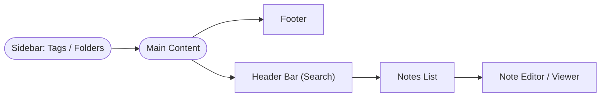

# Notes Frontend: Architecture, Features, and Implementation Overview

## Introduction

The `notes_frontend` project is a lightweight, minimalistic notes application built using React. It enables users to create, view, edit, delete, and search notes in a modern, responsive web UI. The application is designed for ease of use and high performance, utilizing vanilla CSS for styling and persisting data within the browser's `localStorage`. There are no dependencies on heavy UI frameworks or external backend/database services.

---

## Architectural Overview

The project follows a clean, single-page React architecture. All primary application logic resides in a single `App.js` component, which orchestrates UI state, user interactions, and data persistence. The application structure is divided into three main zones:

- **Sidebar**: Displays tags ("folders") and allows filtering notes by tag.
- **Main Content**: Contains both the notes list and the note editor/viewer pane.
- **Footer**: Displays a minimal information bar.

There is no backend or REST API layer; all data is client-side only. The app persists the notes array in `localStorage` to provide offline functionality and data persistence across sessions.

---

## UI Structure

The UI is composed of several hierarchical areas, realized through React elements and styled through CSS variables and rules:

```
[Sidebar]
  └─ Tag List (All Notes, Work, Personal, Ideas, etc.)
  └─ + New Note Button

[Main Content]
  ├─ [Header/Search Bar]
  ├─ [Notes List]
  └─ [Note Editor or Note Viewer]

[Footer]
```

Below is a high-level structure diagram:

```mermaid
flowchart TD
    A[Sidebar (Tags/Folders)]
    B[Main Content]
    C[Footer]

    subgraph B [Main Content]
        D1[Header Bar (Search)]
        D2[Notes List]
        D3[Editor/Viewer Pane]
        D1 --> D2
        D2 --> D3
    end

    A --> B
    B --> C
```

---

### Sidebar

- **Purpose**: Lets users filter notes by tag/category. Shows a list of hard-coded default tags (e.g., "All Notes", "Work", "Personal", "Ideas"), dynamically extended with any tags applied to created notes.
- **Features**: Clicking a tag filters the notes list. "+ New Note" button starts creation of a new note with the current tag preselected.

### Main Content

Composed of:
- **Header Bar**: Contains a search input. Text entered filters the notes list (searches title and body).
- **Notes List**: Shows filtered notes (by search term and selected tag), sorted by most recently updated. Click an item to view in the editor pane.
- **Editor/Viewer Pane**: Displays either an editable form for creating/editing, or a read-only view. Allows tag editing, deletion, and navigation between notes.

### Footer

- Minimal display, serves branding or informational purposes.

---

## Key Features

- **Create Note**: Users can create a new note with a title, body text, and tags. At least one tag is required (auto-falls back to "Untagged" if none provided). 
- **Edit Note**: Existing notes can be edited in place. Title, body, and tags are fully editable.
- **Delete Note**: Notes can be deleted, with a confirmation dialog to prevent accidental deletion.
- **Notes List & Sorting**: Notes are listed and sorted by most recently updated. Quick navigation is supported by clicking titles.
- **Tag/Folder Filtering**: Filter notes by clicking sidebar tags. Tags on notes are flexible and user-editable.
- **Search Functionality**: Live text search over titles and bodies.
- **Responsive & Modern UI**: Layout adapts for desktop and mobile via CSS.
- **Persistence via localStorage**: All notes are saved in the browser and loaded on initialization; no backend required.

---

## Implementation Details

### Code Organization

- **`src/App.js`**: Contains all core UI logic, state management with React hooks, event handler functions for CRUD and search, and JSX layout.
- **`src/App.css`**: Provides all theming and styling, including theme variables and responsive design rules.
- **`src/index.js`**: Entry point that renders the main `<App />` component.
- **No external state libraries or UI frameworks are used.** Styling is pure CSS.
- **localStorage** functions (`loadNotes` and `saveNotes`) abstract browser persistence.

### Data Model

Each note is an object:
```js
{
  id: string,       // unique identifier
  title: string,    // note title
  body: string,     // note body
  tags: [string],   // tags/categories
  createdAt: number,// ms timestamp
  updatedAt: number // ms timestamp
}
```

Tags are managed flexibly and deduplicated for sidebar listing.

### Main Application Flow

1. **Initialization**: Notes are loaded from `localStorage` and React state is initialized.
2. **User Interactions**:
    - Tag selection updates the visible notes list.
    - The search input refines displayed notes in real-time.
    - Clicking "+ New Note" opens the editor in new note mode.
    - Clicking an existing note opens it in view mode, with options to edit/delete.
    - Creating or editing a note updates localStorage automatically.
    - Deletion removes the note and updates the UI instantly.

3. **Persistence**: State changes trigger localStorage updates via a React `useEffect` hook.

### Styling/Theming

- All colors and theme parameters are defined as CSS variables in `src/App.css`.
- Light/dark theme variables are available but dark mode is not enabled by logic in the current shipped app.
- Layout is responsive, with width/padding adjustments for smaller devices.

---

## Feature Implementation Coverage

- **Create Note**: Fully implemented via sidebar button and editor.
- **Edit Note**: Accessible from note view pane.
- **Delete Note**: Via view pane, with confirmation.
- **Search**: Header search bar, live filtered.
- **Tag/Folder support**: Sidebar driven, tag assignment via note editor.
- **Persistence**: Notes survive page reload and browser restart (unless localStorage cleared).
- **Minimal Controls**: Designed to be simple and discoverable by end users.

---

## Summary of the Codebase

- **Technology Stack**: React (functional components), JavaScript (ESNext), CSS, localStorage.
- **File Structure**:
    - All core app logic and UI is in `src/App.js`.
    - Styling in `src/App.css`.
    - No server or API code; this frontend can be paired with a backend for syncing or can remain fully offline.
- **Extensibility**: Easily extendable for new features such as cloud sync, authentication, rich text notes, or sharing.
- **Testing**: A basic React testing setup exists via `App.test.js`, but test coverage is minimal out of the box.

---

## Further Improvements (Possible Future Work)

- Synchronize across devices by adding backend integration.
- Add user authentication.
- Enable dark mode switching in the UI.
- Support for images, formatting, and attachment in notes.
- Enhanced mobile UX and accessibility improvements.

---

## Conclusion

The `notes_frontend` container is a self-contained, modern notes app suitable as a foundation for personal or prototyping use. Its simplicity makes it easy to extend and modify, while its meticulous UI structure provides an excellent user experience.



---

*Generated by DocumentationAgent. Reflects the implementation as of latest codebase review (src/App.js, src/App.css, index.js).*
